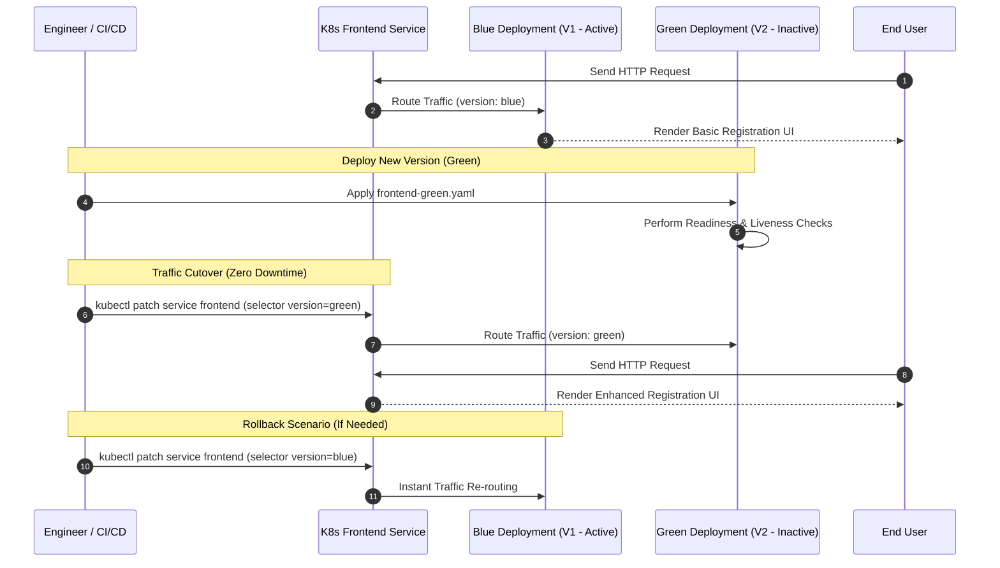

# Container Orchestration & Blue-Green Deployment System


---

## 📌 Executive Summary & Overall Progress Report

This repository contains a full-stack, containerized microservices application engineered for high availability, automated health monitoring, and zero-downtime **Blue-Green Deployment** using **Docker**, **Docker Compose**, and **Kubernetes (Minikube)**.

The project demonstrates a production-grade deployment model where updates (moving from **Frontend Blue** - Basic Registration UI to **Frontend Green** - Enhanced Registration UI) are released into active production with **zero service interruption** and instantaneous rollback capability.

---

## 📊 Overall Completion Checklist

| Requirement / Module | Description | Status | Verification / Manifest |
| :--- | :--- | :---: | :--- |
| **Backend Service** | RESTful Node.js/Express API with CRUD endpoints & health check | ✅ **Complete** | [backend/server.js](file:///d:/auropayrepos/Container-OrchestrationAssign/backend/server.js) |
| **Database Container** | Persistent MongoDB database with health probe integration | ✅ **Complete** | [k8s/mongodb.yaml](file:///d:/auropayrepos/Container-OrchestrationAssign/k8s/mongodb.yaml) |
| **Frontend Blue (V1)** | Basic User Registration UI (`registeredFrom: basic`) | ✅ **Complete** | [k8s/frontend-blue.yaml](file:///d:/auropayrepos/Container-OrchestrationAssign/k8s/frontend-blue.yaml) |
| **Frontend Green (V2)** | Enhanced User Registration UI (`registeredFrom: enhanced`) | ✅ **Complete** | [k8s/frontend-green.yaml](file:///d:/auropayrepos/Container-OrchestrationAssign/k8s/frontend-green.yaml) |
| **Dockerization** | Multi-stage Dockerfiles for all microservices | ✅ **Complete** | Dockerfiles in `./backend`, `./frontend-blue`, `./frontend-green` |
| **Docker Compose** | Multi-container local orchestration with dependency & health checks | ✅ **Complete** | [docker-compose.yml](file:///d:/auropayrepos/Container-OrchestrationAssign/docker-compose.yml) |
| **Kubernetes Probes** | HTTP Liveness & Readiness probes + Exec `mongosh` probes | ✅ **Complete** | Defined in all `k8s/*.yaml` files |
| **Blue-Green Routing** | Zero-Downtime Traffic Migration via K8s Service Selector | ✅ **Complete** | [k8s/frontend-blue.yaml](file:///d:/auropayrepos/Container-OrchestrationAssign/k8s/frontend-blue.yaml#L41-L52) |
| **Rollback Strategy** | Instantaneous single-command traffic rollback | ✅ **Complete** | Service Selector Patching Commands |

---

## 🏗️ System Architecture & Deployment Flow

```mermaid
graph TD
    subgraph Client Access
        U[User Browser / Client]
    end

    subgraph Kubernetes Cluster
        SVR[Frontend Service<br/>NodePort: 3100 / 3200]
        
        subgraph Active Deployment Strategy
            FB[Frontend Blue Deployment<br/>Version: blue | Port 3100]
            FG[Frontend Green Deployment<br/>Version: green | Port 3200]
        end

        BE[Backend API Deployment<br/>ClusterIP | Port 5000]
        DB[(MongoDB Database<br/>Port 27017)]
    end

    U -->|Traffic Routed via Selector| SVR
    SVR -.->|Active: selector version=blue| FB
    SVR == Switching via kubectl patch ==>|Active: selector version=green| FG
    
    FB -->|REST API Requests| BE
    FG -->|REST API Requests| BE
    BE -->|Mongoose DB Driver| DB
```

---

## 🔄 Blue-Green Deployment Lifecycle



---

## 📁 Repository Directory Structure

```
Container-OrchestrationAssign/
├── backend/
│   ├── models/
│   │   └── user.js            # Mongoose User Schema (with registeredFrom field)
│   ├── routes/
│   │   └── users.js           # REST API endpoints (GET, POST, GET /count)
│   ├── .env                   # Backend environment configuration
│   ├── Dockerfile             # Container definition for Backend Service
│   ├── package.json           # Node.js dependencies
│   └── server.js              # Express server entry point with /health endpoint
├── frontend-blue/
│   ├── public/
│   │   ├── index.html         # Basic Registration UI HTML
│   │   └── styles.css         # Blue theme styles
│   ├── Dockerfile             # Container definition for Blue Frontend
│   ├── package.json           # Node.js dependencies
│   └── server.js              # Express static server & /health check (Port 3100)
├── frontend-green/
│   ├── public/
│   │   ├── app.js             # Enhanced UI interactive logic
│   │   ├── index.html         # Enhanced Registration UI HTML
│   │   └── styles.css         # Green theme styles
│   ├── Dockerfile             # Container definition for Green Frontend
│   ├── package.json           # Node.js dependencies
│   └── server.js              # Express static server & /health check (Port 3200)
├── k8s/
│   ├── backend.yaml           # Deployment & ClusterIP Service for Backend
│   ├── frontend-blue.yaml     # Blue Deployment & NodePort Service Router
│   ├── frontend-green.yaml    # Green Deployment (Label selector: version=green)
│   └── mongodb.yaml           # Mongo Deployment, Exec Health Checks & ClusterIP
├── docker-compose.yml         # Local multi-container orchestration manifest
└── README.md                  # Comprehensive Project Documentation
```

---

## 🛠️ Microservices & API Specifications

### 1. Backend REST API (`backend/`)
- **Base URL**: `http://localhost:5000`
- **Health Check**: `GET /health` -> `{"status": "ok", "message": "Backend API is running"}`
- **User Creation**: `POST /api/users` -> Accepts user payload with `registeredFrom: "basic" | "enhanced"`.
- **User Listing**: `GET /api/users` -> Returns all user documents.
- **Analytics Endpoint**: `GET /api/users/count` -> Returns registration distribution breakdown:
  ```json
  {
    "total": 12,
    "basicUI": 7,
    "enhancedUI": 5
  }
  ```

### 2. Database Service (`mongodb`)
- **Image**: `mongo:7`
- **Port**: `27017`
- **Health Check**: `mongosh --eval "db.adminCommand('ping')"`

### 3. Frontend Blue (`frontend-blue/`)
- **Version**: V1 (Basic UI)
- **Port**: `3100`
- **Health Check**: `GET /health` -> `{"status": "ok", "version": "basic"}`

### 4. Frontend Green (`frontend-green/`)
- **Version**: V2 (Enhanced UI)
- **Port**: `3200`
- **Health Check**: `GET /health` -> `{"status": "ok", "version": "green"}`

---

## 🚀 Execution & Deployment Guide

### Prerequisites
- [Docker Desktop](https://www.docker.com/) (with Docker Engine & Docker Compose)
- [Minikube](https://minikube.sigs.k8s.io/docs/start/) & `kubectl` CLI
- Node.js v18+

---

### Option A: Local Deployment via Docker Compose

Run the entire microservices stack locally with container dependency ordering and automated healthchecks:

1. **Start all containers**:
   ```bash
   docker compose up --build -d
   ```

2. **Verify container status**:
   ```bash
   docker compose ps
   ```

3. **Access Services**:
   - **Frontend Blue (Basic UI)**: `http://localhost:3100`
   - **Frontend Green (Enhanced UI)**: `http://localhost:3200`
   - **Backend API**: `http://localhost:5000`
   - **Backend Health Check**: `http://localhost:5000/health`

4. **Teardown**:
   ```bash
   docker compose down -v
   ```

---

### Option B: Kubernetes Blue-Green Deployment (Minikube)

#### 1. Start Minikube & Configure Environment
```bash
minikube start

# Optional: Build images inside Minikube's Docker registry
minikube image build -t container-orchestrationassign-backend:latest ./backend
minikube image build -t container-orchestrationassign-frontend-blue:latest ./frontend-blue
minikube image build -t container-orchestrationassign-frontend-green:latest ./frontend-green
```

#### 2. Deploy Database & Backend
```bash
kubectl apply -f k8s/mongodb.yaml
kubectl apply -f k8s/backend.yaml
```

#### 3. Deploy Blue (Active Production)
```bash
kubectl apply -f k8s/frontend-blue.yaml
```
Verify that the `frontend` service routes traffic to `version: blue`:
```bash
kubectl describe svc frontend
```

#### 4. Deploy Green (Staging / Release Candidate)
```bash
kubectl apply -f k8s/frontend-green.yaml
```
At this stage, both Blue and Green pods are running, but the `frontend` service **only** forwards public incoming traffic to Blue pods (`version: blue`).

---

## ⚡ Blue-Green Switchover & Rollback Operations

### 1. Perform Zero-Downtime Switch to Green (V2)
To migrate 100% of live user traffic to the Green deployment, patch the Kubernetes Service selector:

```bash
kubectl patch service frontend --type='merge' -p '{"spec":{"selector":{"app":"frontend","version":"green"}}}'
```

Alternatively using basic JSON patch:
```bash
kubectl patch service frontend -p '{"spec":{"selector":{"version":"green"}}}'
```

### 2. Verify Active Routing
Check the service endpoint mapping:
```bash
kubectl get endpoints frontend
```
All incoming traffic now seamlessly routes to the **Frontend Green** pod instance without terminating any existing client connections.

### 3. Instant Rollback Procedure
If any metric anomaly or error occurs in production, execute an immediate 1-second rollback to **Frontend Blue**:

```bash
kubectl patch service frontend -p '{"spec":{"selector":{"version":"blue"}}}'
```

---

## 🩺 Automated Health Probes & Monitoring

All Kubernetes manifests integrate native **Readiness** and **Liveness** probes:

- **MongoDB (`k8s/mongodb.yaml`)**:
  - Uses `mongosh --eval "db.adminCommand('ping')"` exec probes to verify database readiness before backend startup.
- **Backend API (`k8s/backend.yaml`)**:
  - Uses HTTP GET probe on `/health` (initial delay: 10s, period: 5s).
- **Frontends (`k8s/frontend-blue.yaml` & `k8s/frontend-green.yaml`)**:
  - Uses HTTP GET probe on `/health` (initial delay: 5s, period: 5s).

---

## 📝 Verification & Troubleshooting

### Check Pod Health & Logs
```bash
# Get running status of all pods
kubectl get pods -o wide

# Check backend logs
kubectl logs -l app=backend -f

# Check frontend blue / green logs
kubectl logs -l app=frontend,version=blue
kubectl logs -l app=frontend,version=green

# View detailed describe output for service routing
kubectl describe svc frontend
```

---

## 📜 License
This project is released under the **MIT License**.

